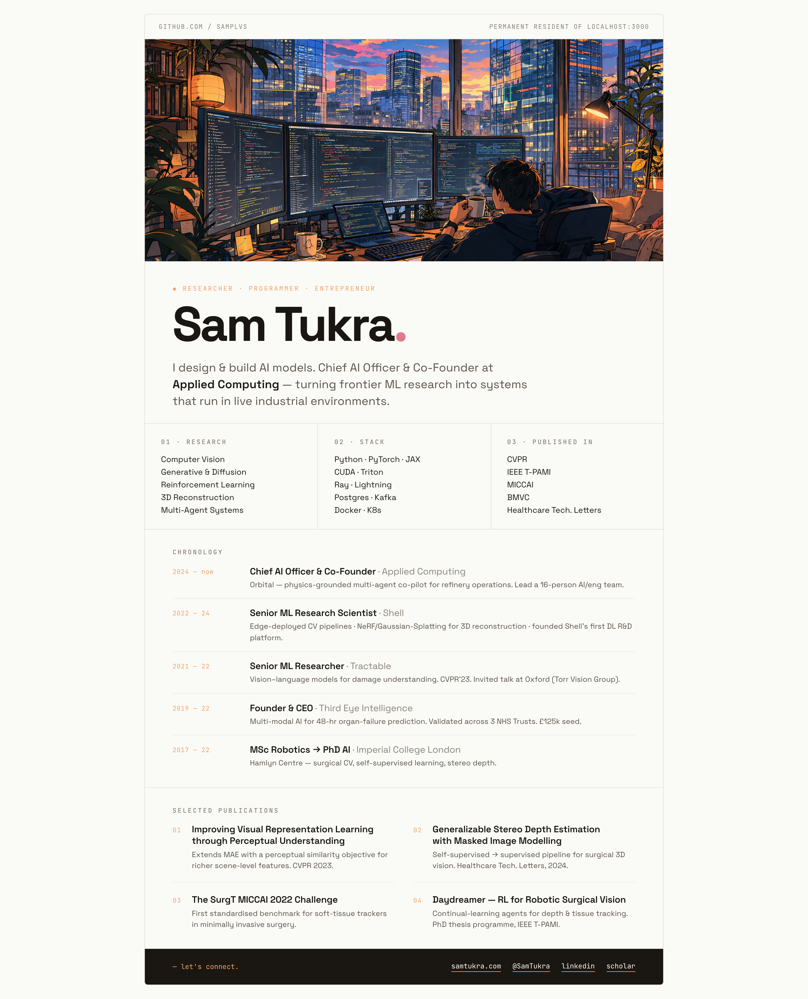

<!--
  Sam Tukra · github.com/SamPlvs
  Profile image is a render of index.html (served at samplvs.github.io/SamPlvs)
  in dark + light prefers-color-scheme variants. GitHub picks the right one
  for the viewer's theme via the <picture> element below.
-->

<a href="https://samplvs.github.io/SamPlvs/">
  <picture>
    <source media="(prefers-color-scheme: dark)" srcset="assets/profile-dark.png">
    <source media="(prefers-color-scheme: light)" srcset="assets/profile-light.png">
    
  </picture>
</a>

---

### Connect

- 🌐 [samtukra.com](https://samtukra.com/)
- 🐦 [@SamTukra](https://twitter.com/SamTukra)
- 💼 [LinkedIn](https://www.linkedin.com/in/samyakhtukra/)
- 📚 [Google Scholar](https://scholar.google.com/citations?user=Mkxk50oAAAAJ)

↑ Click the image for the live interactive version at <a href="https://samplvs.github.io/SamPlvs/"><code>samplvs.github.io/SamPlvs</code></a>.
